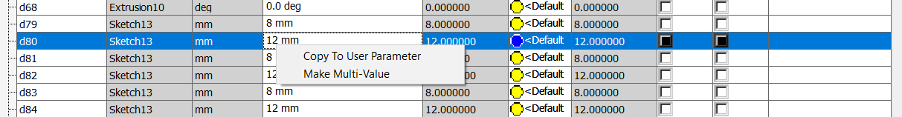
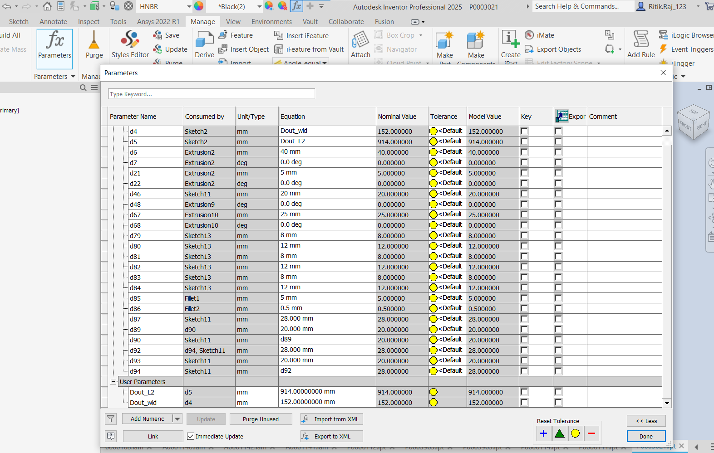
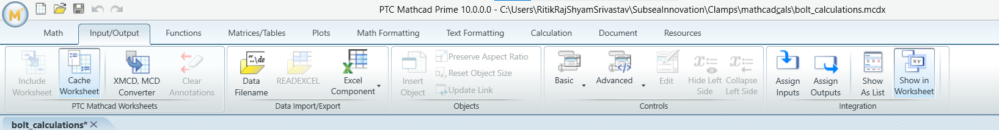

# Autodesk Inventor CAD Automation

## 📝 Description

An automation tool designed to streamline the design of engineering components using MathCAD and Autodesk Inventor APIs.  
Due to confidentiality, the script focuses on designing parts and sub-assemblies of a large offshore clamp assembly.

- Prompts the user to select pipe **size**, **standard**, and **thickness**.
- Performs critical engineering calculations via the **MathCAD API**.
- Uses results to generate **fully parameterized 3D models** and **technical drawings** in Autodesk Inventor.
- Reduces manual modelling effort while ensuring **standards compliance**.

  **📹 Video Demo:** [Watch now]([(https://youtu.be/jXdbaYtqJoY)])

---

## 🚀 Features

- Flexible pipe configuration through user inputs for size, standard, and thickness.
- Integration with **MathCAD API** to perform real-time calculations compliant with ASME, ISO, and DNVGL standards.
- Fully automated 3D modeling and drawing generation using **Autodesk Inventor API**.
- Parameter-driven part files for scalable and customizable modeling.

---

## 🛠️ Usage

To run this project successfully, ensure the following prerequisites and setup:

- ✅ A licensed copy of **Autodesk Inventor** and **MathCAD v10.0** is required.
- 📁 A **reference part or model** must be saved locally to serve as a base.
- 📄 **Engineering calculations** must be prepared and saved in a MathCAD worksheet.
- ⚠️ This script is meant for **reference and automation setup** — not direct reuse of a final model.
- 🧩 Model parameters must be exposed as **User Parameters** in Inventor, allowing script-driven updates.

> **🔧 Important:** Developers must **update the part numbers, MathCAD worksheet files, standards references, and all file paths** in the script according to their project or company standards. These are placeholders and must be tailored to the actual use case.


### 🧭 How to Create a User Parameter in Inventor
## Features 


1. Right-click on a dimension.
2. Select **"Add to User Parameters"**.





---

## 🧮 MathCAD Integration

### Defining Input/Output Variables

In **MathCAD**, to create input/output variables:

- Go to the **Integration** tab.
- Select a variable and assign it as **Input** or **Output**.




### API Notes

- **Input variables** are accessible by name in the MathCAD API.
- **Output variables** must be retrieved using generic keys like `output`, `output_1`, `output_2`, etc.

To handle this:

```python
out_to_var = {
    'out': 'Dout_wid',
    'out_0': 'Din_wid',
    'out_1': 'LO1AE_l',
    'out_10': 'Do_AE',
    'out_11': 'DIC'
}


